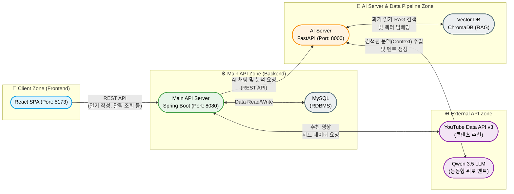

# 🌼 Freesia (프리지아) : 내 마음을 알아주는 AI 감정 일기장

> "당신의 하루에 피어나는 따뜻한 위로"
> AI 기반 감정 분석, 능동형 공감 챗봇 및 음악 추천 다이어리 서비스


<br/>

## 💡 프로젝트 기획 배경 및 목표

바쁘고 지친 현대인들이 일기를 쓰며 하루를 돌아볼 때, 프리지아 꽃의 꽃말인 **'당신의 시작을 응원합니다'**처럼 따뜻한 색감과 AI의 다정한 피드백을 통해 심리적 안정감을 제공하고자 기획했습니다. 
단순한 '명령-응답' 형태를 넘어, **사용자의 과거 기록을 기억하고 먼저 안부를 물어보는 능동형 AI 비서**와 **감정 맞춤형 음악 추천 시스템**을 결합한 힐링 다이어리를 제공합니다.

<br/>

## 📸 서비스 화면 (Preview)

<p align="center">
  
  
  
</p>

<br/>

## 🛠 기술 스택 (Tech Stack)

### Frontend
- **Framework:** React, TypeScript, Vite
- **Styling:** Tailwind CSS
- **State & Routing:** Zustand (`authStore.ts`), React Router

### Backend (Main API)
- **Framework:** Java 17, Spring Boot 3.x, Spring Data JPA
- **Database:** MySQL
- **Auth:** JWT (JSON Web Token), Spring Security

### AI Server & Data Pipeline
- **Framework:** Python, FastAPI, Uvicorn
- **Vector DB:** ChromaDB (RAG 기억 저장소)
- **AI Model:** Qwen/Qwen3.5-35B-A3B-FP8 (LLM API), KR-SBERT (Sentence Transformer)
- **ML/Data:** Scikit-learn, MLflow, Pandas (감정 분류 모델)

### Infra & Tools
- **Deployment:** Docker, Docker Compose, Nginx
- **AI-Assisted Dev:** LLM 기반 바이브 코딩(Vibe Coding)

<br/>

## 🏗 시스템 아키텍처 및 디렉토리 구조

### System Architecture
```text
Client (React, 5173) 
  ↔ Main API Server (Spring Boot, 8080) 
  ↔ AI Server (FastAPI, 8000) 
      ↳ [RAG Pipeline] ↔ Vector DB (ChromaDB)
  ↔ External API (Qwen 3.5 LLM / YouTube Data API v3)
```

```text
FREESIA-FINAL/
├── 📁 frontend/ (React SPA)
│   ├── src/ (api, assets, components, pages, store)
│   ├── Dockerfile
│   └── nginx.conf
├── 📁 backend/ (Spring Boot REST API)
│   ├── src/main/java/com/freesia/backend
│   │   ├── analysis/       # AI 서버 통신 도메인
│   │   ├── chat/           # 채팅 로직
│   │   ├── diary/          # 일기 및 감정 처리
│   │   ├── member/         # 회원 및 JWT 인증
│   │   └── recommendation/ # 외부 콘텐츠 크롤링 및 추천 스케줄러
│   └── Dockerfile
└── 📁 ai-server/ (FastAPI & ML Pipeline)
    ├── data/               # 말뭉치 데이터 전처리 파이프라인
    ├── training/           # MLflow 기반 감정 분류 모델 학습
    ├── app.py              # FastAPI 엔드포인트 및 LLM 프롬프트 주입
    └── rag_service.py      # ChromaDB 벡터 검색 모듈
```



## ✨ 핵심 기능 (Key Features)

1. **RAG 기반 능동형 챗봇:** 자유 채팅 중 사용자의 과거 일기를 검색하여 시스템 프롬프트에 주입, 과거를 기억하고 안부를 묻는 인간적인 공감형 대화 구현.
2. **인터랙티브 감정 달력:** Tailwind CSS 애니메이션(`scale-in`)을 적용하여 날짜별 감정을 시각화하고, 부드러운 모달 인터랙션 제공.
3. **감정 기반 콘텐츠 추천:** YouTube API 크롤링 및 DB 캐싱을 통해 분석된 감정에 어울리는 영상을 추천하고, '싫어요' 피드백을 반영하는 실시간 개인화 로직 적용.

<br/>

## 🔥 핵심 트러블 슈팅 (Troubleshooting)

이 프로젝트는 단순 API 연동을 넘어 개발 과정에서 마주한 **구조적 한계와 버그를 논리적으로 분석하고 해결하는 과정**에 집중했습니다.

### 1. [AI/RAG] 벡터 검색의 한계와 시간 기반 필터링 도입
- **문제:** "오늘 하루 어땠어?" 같은 모호한 질문 입력 시, 단순 의미 유사도 기반의 Vector DB 검색으로는 엉뚱한 과거 데이터를 가져와 맥락이 단절되는 현상 발생.
- **해결:** 일기장 도메인의 핵심인 '시간적 맥락'을 부여하기 위해 메타데이터(`date`) 필터링과 **최신순 정렬(Recency Sorting)** 로직을 구현했습니다.

```python
# ai-server/rag_service.py 일부
def search_similar_diaries(query_text: str, top_k: int = 3) -> list:
    # 1. 자연어에서 날짜 메타데이터 필터 분석 (오늘, 어제 등)
    target_date = _extract_date_filter(query_text)
    where_clause = {"date": target_date} if target_date else None
    
    # ... (Vector DB 검색 수행) ...
    
    # 2. 최신 날짜 우선순위 정렬 (내림차순 정렬)로 인간의 기억 구조 모방
    similar_diaries.sort(key=lambda x: x["date"], reverse=True)
    return similar_diaries
```

### 2. [Backend] 한국 표준시(KST) 불일치 및 서버 주도형 시간 관리
- **문제:** 새벽 시간대(00:00~09:00)에 일기 작성 시 브라우저 환경에 따라 DB에 하루 전날(UTC)로 저장되는 데이터 무결성 붕괴 발생.
- **해결:** 클라이언트 전송 데이터를 무조건 신뢰하는 대신, Spring Boot 엔티티 생명주기 콜백(`@PrePersist`)을 활용하여 서버 단에서 KST 시간을 강제 오버라이트하도록 아키텍처를 변경했습니다.

```java
// backend/.../diary/entity/Diary.java 일부
@PrePersist
public void prePersist() {
    // 기존 UTC 문제 코드: this.date = LocalDate.now();
    // 데이터 무결성을 위해 KST 강제 주입
    this.date = LocalDate.now(ZoneId.of("Asia/Seoul")); 
}
```

### 3. [Data] 추천 콘텐츠 시드 중복 및 무한 반복 현상
- **문제:** 추천 API 호출 시 `System.nanoTime()` 기반 Random 시드의 실행 속도가 너무 빨라 루프 내에서 동일한 시드값이 적용되어 같은 콘텐츠만 무한 노출됨.
- **해결:** 매 추출마다 완전히 새로운 인스턴스로 셔플을 보장하고, 사용자의 '싫어요(Feedback)' 데이터를 스트림 필터로 분리하는 완벽한 무작위 개인화 로직을 완성했습니다.

```java
// backend/.../recommendation/service/RecommendationService.java 일부

// 1. 사용자의 싫어요(dislikedIds) 목록을 조회하여 제외 (개인화 필터링)
List<Recommendation> filteredRecommendations = allRecommendations.stream()
        .filter(rec -> !finalDislikedIds.contains(rec.getId()))
        .collect(Collectors.toList());

// 2. 전체 리스트를 나노초 시드로 완전히 셔플하여 무작위성 보장
Collections.shuffle(filteredRecommendations, new Random(System.nanoTime()));
```

### 4. [Frontend] 긴 컨텐츠로 인한 UI 크래시(White Screen) 및 모달 이탈
- **문제:** 일기 내용과 추천 카드가 많아질 경우 브라우저 뷰포트(Viewport)를 뚫고 나가거나 닫기 버튼이 클릭되지 않는 치명적 렌더링 오류 발생.
- **해결:** 화면 전체가 아닌 모달 컨테이너 내부에만 독립적인 스크롤바가 생기도록 동적 높이 제어 클래스를 주입했습니다.

```tsx
// frontend/src/components/EmotionCalendar.tsx 일부
<div 
  // max-h-[90vh] 와 overflow-y-auto 를 통해 뷰포트 대비 안전한 모달 UI 보장
  className="bg-white rounded-3xl p-8 max-w-2xl w-full mx-4 shadow-2xl animate-scale-in max-h-[90vh] overflow-y-auto"
  onClick={(e) => e.stopPropagation()}
>
  {/* 모달 컨텐츠 */}
</div>
```

## 🚀 시작하기 (Getting Started)
프로젝트를 로컬 환경에서 실행하는 방법입니다.

```bash
# 1. Repository 클론
$ git clone [https://github.com/사용자명/freesia-capstone.git](https://github.com/사용자명/freesia-capstone.git)

# 2. 로컬 설정 파일 추가 (필수)
# backend/src/main/resources/application-secret.yml 생성 후 DB 및 외부 API 키 입력
# ai-server/.env 생성 후 DCU_LLM_API_KEY 입력

# 3. Docker Compose를 활용한 전체 서버 빌드 및 백그라운드 실행
$ docker compose up --build -d
```

## 🚀 향후 계획 (Future Plans)

현재 프로젝트를 기반으로 다음과 같은 기능 고도화와 기술적 개선을 계획하고 있습니다.

1. **AI 서비스 성능 고도화:** 현재 사용 중인 Qwen 모델 외에, 특정 감정 상황에서 더 세밀한 공감이 가능한 Fine-tuning 모델을 도입하여 위로 멘트의 품질을 개선할 예정입니다.
2. **다중 감정 분석 파이프라인:** 단일 감정 분류를 넘어, 사용자의 일기에서 느껴지는 복합적인 감정(예: 기쁘지만 걱정되는)을 다중 라벨링(Multi-labeling) 방식으로 분석하여 더욱 정교한 위로를 제공할 계획입니다.
3. **사용자 경험(UX) 확장:** 사용자가 자신의 감정 변화 추이를 한눈에 파악할 수 있도록 월간/연간 감정 통계 리포트 대시보드를 시각화하여 추가할 예정입니다.
4. **인프라 자동화 (CI/CD):** 현재는 `docker-compose`를 통한 로컬 기반 배포 중심이지만, GitHub Actions와 AWS를 연동하여 코드 푸시 시 자동 빌드 및 배포가 이루어지는 파이프라인을 구축할 계획입니다.
